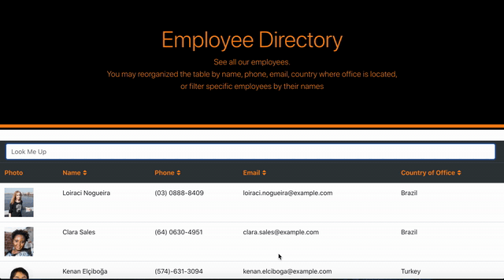

# Employee_Directory

[Live App](https://mikeltafalla.github.io/Employee_Directory/)

Keep always up to date with your comapny employees. This Employee Directory gives you access to all your employees (including their profile picture, name, phone, email, and the country where their office is located).

# Technologies Used

1. React.js, HTML, Bootstrap, CSS
2. Random Users API. [See here](https://randomuser.me/api/?results=10)

# Table of Contents

* [Installation](#installation)
* [Instructions](#instructions)
* [Example Gif](#example-gif)
* [Acknowledgment](#acknowledgment)
* [Author](#author)

## Installation
> 1.npm install

## Instructions
> Open your browser and go to [Employee_Directory](https://mikeltafalla.github.io/Employee_Directory/). All you employees will be listed. Using the search bar you could look for specific names and/or last names to faster find the information of the employee you are looking for. You could reorganize your employee's table by descending or ascending alphabetical order, phone number, email and country.

## Example Gif

## Acknowledgment

I'd like to acknowledge Isabel [iarcones](https://github.com/iarcones/react-employee-directory). The design of this homework was inspired by her own design.

## Author 

**MikelTafalla**

Email: mikel362d@gmail.com

Location: Santa Barbara

GitHub: https://github.com/MikelTafalla

